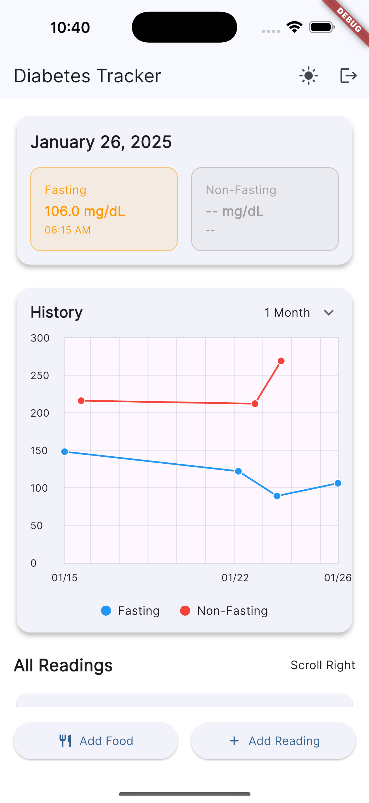
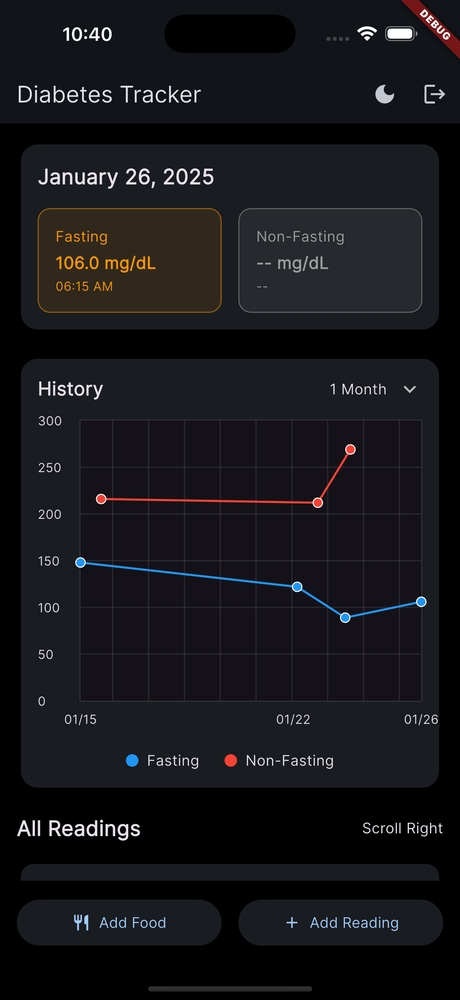
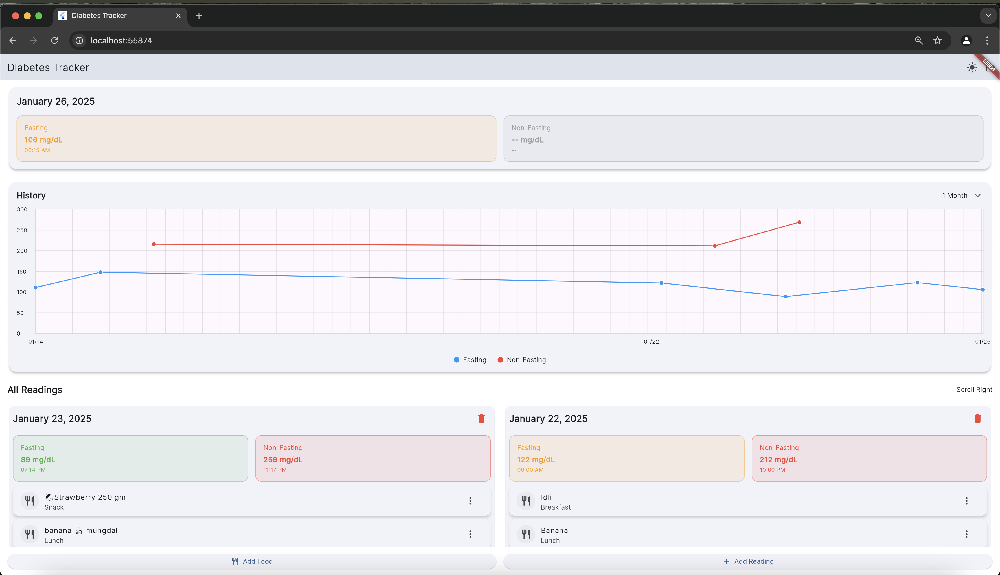
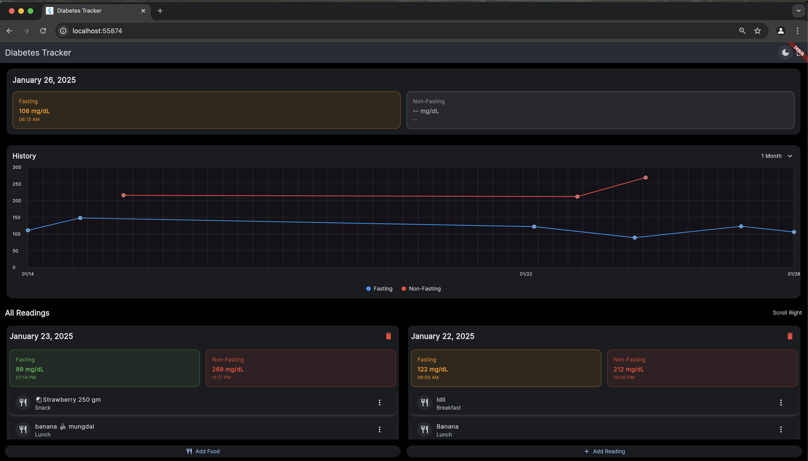

# Diabetes Tracker App 🚑

A modern Flutter application designed to help users track their blood glucose levels and manage their diabetes data with ease. 🩸 Whether you're monitoring fasting or non-fasting glucose, or keeping track of meals, this app provides an intuitive and interactive experience to keep your health in check.

[](LICENSE)

<a href="https://codefusionbit.com/" target="_blank" rel="noopener noreferrer">
  
</a>

## Features 🖼️
<div align="center">
  <!-- Mobile Screenshots -->
  <div style="margin-bottom: 20px;">
    
    
  </div>

  <!-- Web Screenshots -->
  <div>
    
    
  </div>
</div>

## Features 🌟
- **Blood Glucose Monitoring** (Fasting/Non-Fasting)
- **Interactive Charts & Analytics** to track your progress 📊
- **Food Diary** with meal tracking 🍏🥘
- **Dark/Light Mode** for a customizable UI 🌙💡
- **Cloud Sync** with Firebase for real-time data backup ☁️
- **Offline Support** to keep you going without an internet connection ⚡

## Tech Stack ⚙️
- **Flutter** & **Dart**: For a fast and smooth mobile experience
- **Firebase**: Authentication & Firestore for cloud-based data storage
- **GetX**: State management for seamless app performance
- **FL Chart**: Beautiful and interactive charts
- **Google Fonts**: Custom fonts to enhance the app’s look

## Getting Started 🚀

### Prerequisites 📋
Before running the app, make sure you have the following installed:
- [Flutter SDK](https://flutter.dev/docs/get-started/install)
- [Firebase Account](https://firebase.google.com/)
- **IDE**: [VS Code](https://code.visualstudio.com/) or [Android Studio](https://developer.android.com/studio)

### Clone Repository 📥
```
git clone https://github.com/codefusionbit/diabetes_tracker.git
cd diabetes_tracker
```

### Firebase Setup 🔐

1. **Set Up Firebase for the Project**:
   - Go to the [Firebase Console](https://console.firebase.google.com/) and create a new project.
   - Enable **Firebase Authentication**:
      - Navigate to **Authentication** > **Sign-in method**.
      - Enable the **Email/Password** provider.
   - Enable **Cloud Firestore**:
      - Navigate to **Firestore Database**.
      - Create a new Firestore database in production mode or test mode.
      - Set up the necessary security rules for your app.
        **Firestore database rules**
         ```
         rules_version = '2';
         service cloud.firestore {
           match /databases/{database}/documents {
             match /users/{userId}/{document=**} {
               allow read, write: if request.auth != null && request.auth.uid == userId;
             }
           }
         }
         ```
   - Log in to Firebase via CLI:
     ```bash
     firebase login
     ```
   - Configure Firebase in your Flutter project:
     ```bash
     flutterfire configure
     dart pub global activate flutterfire_cli
     flutterfire configure --project={Your Project}
     ```


2. **Add Configuration Files**:
   - **Android**: Place `google-services.json` in the `android/app` directory.
   - **iOS**: Place `GoogleService-Info.plist` in the `ios/Runner` directory.
   - **Web**: Add Firebase configuration to the `index.html` file.

3. **Enable Firebase Services**:
   - Authentication (Email/Password)
   - Cloud Firestore
   - (Optional) Hosting for web apps

---

### Running the Project

1. Install project dependencies:
   ```bash
   flutter pub get
   flutter run 
   ```
### Project Structure
```
lib/
  ├── controller/      
  │   ├── auth_controller.dart
  │   ├── glucose_controller.dart
  │   └── theme_controller.dart
  ├── model/
  │   ├── daily_reading.dart
  │   └── food_record.dart
  ├── view/
  │   ├── auth/
  │   │   ├── login_screen.dart
  │   │   └── signup_screen.dart 
  │   └── dashboard/
  │       └── home_screen.dart
  └── widget/
      ├── horizontal_list_view.dart
      └── snap_scroll_physic.dart
```

## 🚀 Planned Features

#### UI/UX
- Custom theme manager
- Profile management
- Enhanced data visualization
- Accessibility improvements

#### Core Features
- Multilingual support
- PDF/CSV export capabilities
- Medicine tracking system
- Doctor appointment management
- Health targets monitoring

#### Development
- Comprehensive unit testing
- Detailed documentation
- Performance optimization
- Code quality tools implementation

## 🤝 Contributing
We welcome contributions to enhance the functionality and usability of the app!
### Steps to Contribute

1. **Fork the Repository**: Clone the forked repository to your local machine.

2. **Create a Feature Branch**: Work on a feature branch to keep changes isolated.
   ```bash
   git checkout -b feature/new-feature
   ```

3. **Commit Your Changes**:
   * Write clear and concise commit messages.
   ```bash
   git commit -m "Add feature description"
   ```

4. **Push to Remote**:
   ```bash
   git push origin feature/new-feature
   ```

5. **Submit a Pull Request**:
   * Provide a detailed description of the changes in your PR.
   * Address any feedback from reviewers.
## License

This project is licensed under the MIT License - see the LICENSE.md file for details

## Contact

- Company: CODEFUSION BIT LLP
- Website: https://codefusionbit.com/
- Developer: Hitesh Sapra ([@saprahits](https://github.com/saprahits))

## Acknowledgments

- Contributors
- Flutter Community
- Open Source Libraries used in this project

